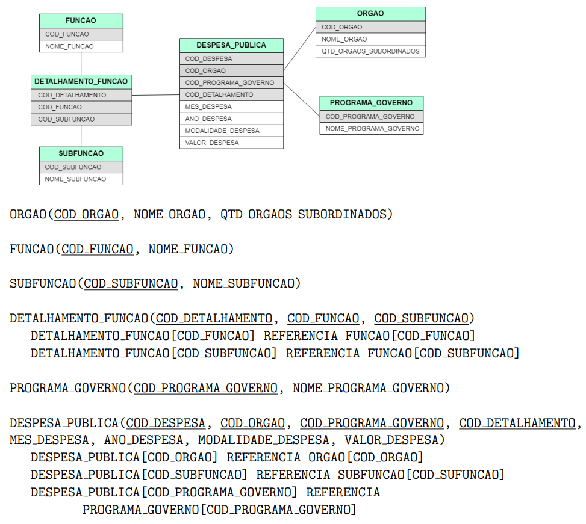

# Trabalho Prático 1

## Esquema do Banco de Dados Utilizado

## Entrega
Para completar este trabalho prático, deve-se expressar as consultas propostas no notebook `ibd_tp_01.ipynb` em `SQL` e submetê-lo até o dia 23/01/2022 às 23hrs:59min.

## Quickstart
Para realização do **Trabalho Prático 1** sugerimos fazer uso do [Google Colab](https://colab.research.google.com/). 
O mesmo permite conectar com o Github, executar notebooks e fazer uso de GPUs e TPUs. 

No sub-diretório `learning_trail/` existe alguns exemplos que podem ser úteis, tais como:

* **SQLite.ipynb:** ilustra algumas consultas SQL;
* **pandas.ipynb:** demonstra algumas operações utilizando o Pandas.